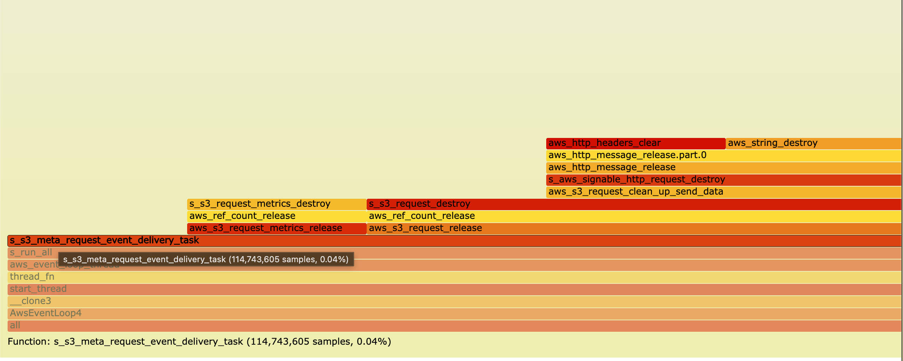
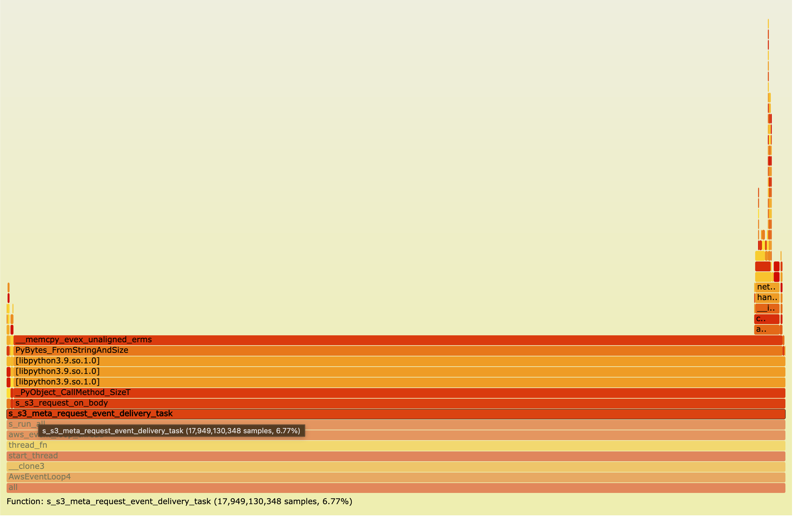
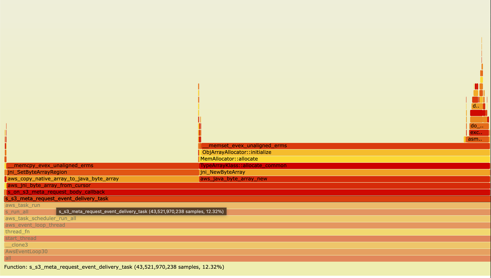

# CRT Bindings Performance Analysis: Quantifying Language Binding Overhead

## Executive Summary

This document analyzes the performance overhead introduced by language bindings in AWS CRT (Common Runtime) implementations. We measured the cost of delivering 30 GiB of data from S3 to RAM across three language bindings (C, Java, Python) to quantify the overhead of cross-language data marshalling through language boundary.

NOTE: This shows the major bottleneck for the specific download case. There could be other bottlenecks else where.

### What is CRT binding and Why Does It Matter?

In AWS CRT:

- **Core Implementation**: Written in C for performance and portability
- **Language Bindings**: Python, Java, and other languages wrap the C implementation
- **The Challenge**: Data from C must be converted into native language objects

**Why Data Marshalling is Required:**

1. **Different Memory Models**
   - C uses raw pointers and manual memory management
   - Python uses reference-counted objects (PyObject*)
   - Java uses garbage-collected heap objects with JVM memory management

2. **Type Safety and Runtime Expectations**
   - C: `void* buffer` with length → raw bytes
   - Python: Expects `bytes` object with proper reference counting
   - Java: Expects `ByteBuffer` object managed by JVM

3. **The FFI Boundary**
   - When C code receives data from S3, it's in a C-owned buffer
   - To make this data accessible to Python/Java applications, it must be "wrapped" or "copied" into language-native objects
   - This conversion process is called **data marshalling**

**Why This Matters for Performance:**

Each time data crosses from C → Python/Java:
1. Allocate new object in managed runtime (Python: PyObject, Java: DirectByteBuffer)
2. Initialize object metadata (type info, reference counts, JVM headers)
3. Associate object with C memory or copy data
4. Track object for garbage collection

For a 30 GiB download broken into lots buffers, this happens lots times, creating significant overhead.

### Key Findings

| Language | Throughput | Duration | Event Delivery Overhead | Performance vs C |
|----------|------------|----------|------------------------|------------------|
| **C (Baseline)** | 69.4 Gb/s | 3.7s | 0.04% | 100% |
| **Python** | 33.5 Gb/s | 7.7s | 6.77% | 48.3% |
| **Java** | 15.7 Gb/s | 16.4s | 12.32% | 22.6% |

**Main Observation**: Language bindings introduce significant overhead through data marshalling at the FFI boundary, with Java showing 4.4x slower performance and Python showing 2.1x slower performance compared to native C implementation.

---

## Test Methodology

### Test Configuration

- **Workload**: Download single 30 GiB file from S3 to RAM
- **Bucket**: `aws-c-s3-test-bucket-269381--usw2-az1--x-s3`
- **Region**: `us-west-2`
- **Target throughput**: 200.0 Gb/s
- **Profiling**: Linux `perf` with 99 Hz sampling frequency

### Measurement Focus

We focused on the **event delivery task** ( `__s3_meta_request_event_delivery_task` ), which is responsible for delivering data buffers from the C runtime to the application layer. This is where the primary binding overhead manifests.

---

## Detailed Performance Analysis

### 1. C Implementation (Baseline)

```bash
sudo perf record -F 99 --call-graph dwarf -g \
  /home/ec2-user/aws-crt-s3-benchmarks/runners/s3-benchrunner-c/build/s3-benchrunner-c \
  crt-c ~/aws-crt-s3-benchmarks/workloads/download-30GiB-1x-ram.run.json \
  aws-c-s3-test-bucket-269381--usw2-az1--x-s3 us-west-2 200.0
```

**Results:**
- **Throughput**: 69.4 Gb/s
- **Duration**: 3.7 seconds
- **Peak RSS**: 12,214 MiB
- **Event Delivery Total**: 114,743,605 samples (0.04%)
- **aws_s3_request_release**: 59,924,208 samples (0.02%)
- **Percentage within Event Delivery**: 52.22%

**Analysis**: The C implementation shows minimal overhead in event delivery. Most of the event delivery time (52.22%) is spent in `aws_s3_request_release` , which is actual cleanup work rather than data marshalling overhead.



**Interactive Flamegraph**: [View full html flamegraph](c-benchmark.html) for detailed analysis

---

### 2. Python Implementation

```bash
sudo perf record -F 99 -g \
  ~/aws-crt-s3-benchmarks/build/python/venv/bin/python \
  /home/ec2-user/aws-crt-s3-benchmarks/runners/s3-benchrunner-python/main.py \
  crt-python /home/ec2-user/aws-crt-s3-benchmarks/workloads/download-30GiB-1x-ram.run.json \
  aws-c-s3-test-bucket-269381--usw2-az1--x-s3 us-west-2 200.0
```

**Results:**
- **Throughput**: 33.5 Gb/s
- **Duration**: 7.7 seconds (2.1x slower than C)
- **Event Delivery Total**: 17,949,130,348 samples (6.77%)
- **aws_s3_request_release**: 102,260,458 samples (0.04%)
- **Percentage within Event Delivery**: 0.57%

**Analysis**:
- Event delivery overhead increased from 0.04% (C) to 6.77% (Python) — a **169x increase**
- Only 0.57% of event delivery time is spent in cleanup (`aws_s3_request_release`)
- **The remaining ~99.4% is pure binding overhead**: wrapping C buffers into Python bytes objects

**Overhead Breakdown**:
- Total overhead: 17,949,130,348 samples
- Cleanup overhead: 102,260,458 samples (0.57%)
- **Data marshalling overhead**: ~17,846,869,890 samples (99.43%)



**Interactive Flamegraph**: [View full html flamegraph](python-benchmark.html) for detailed analysis

---

### 3. Java Implementation

```bash
sudo perf record -F 99 --call-graph dwarf -g \
  java -jar /home/ec2-user/aws-crt-s3-benchmarks/runners/s3-benchrunner-java/target/s3-benchrunner-java-1.0-SNAPSHOT.jar \
  crt-java ~/aws-crt-s3-benchmarks/workloads/download-30GiB-1x-ram.run.json \
  aws-c-s3-test-bucket-269381--usw2-az1--x-s3 us-west-2 200.0
```

**Results:**
- **Throughput**: 15.7 Gb/s
- **Duration**: 16.4 seconds (4.4x slower than C)
- **Event Delivery Total**: 43,521,970,238 samples (12.32%)
- **aws_s3_request_release**: 168,125,089 samples (0.05%)
- **Percentage within Event Delivery**: 0.39%

**Analysis**:
- Event delivery overhead increased from 0.04% (C) to 12.32% (Java) — a **308x increase**
- Only 0.39% of event delivery time is spent in cleanup
- **The remaining ~99.6% is pure binding overhead**: creating Java DirectByteBuffer objects around C memory

**Overhead Breakdown**:
- Total overhead: 43,521,970,238 samples
- Cleanup overhead: 168,125,089 samples (0.39%)
- **Data marshalling overhead**: ~43,353,845,149 samples (99.61%)



**Interactive Flamegraph**: [View full html flamegraph](java-benchmark.html) for detailed analysis

---

## Control Experiment: Download to Disk

To validate that the overhead is specifically from data marshalling (not from the binding implementations themselves), we conducted a control experiment: downloading a 5 GiB file directly to disk instead of RAM. When writing to disk, the C runtime writes directly without delivering data buffers to the application layer.

### Test Configuration

- **Workload**: Download single 5 GiB file from S3 to disk
- **Bucket**: `aws-c-s3-test-bucket-269381--usw2-az1--x-s3`
- **Region**: `us-west-2`

### Results Summary

| Language | Throughput | Duration | Performance vs C |
|----------|------------|----------|------------------|
| **C** | 14.08 Gb/s | 3.05s | 100% (baseline) |
| **Java** | 14.10 Gb/s | 3.05s | 100.1% |
| **Python** | 13.05 Gb/s | 3.29s | 92.7% |

### Key Observations

1. **Near-identical performance across all implementations** when writing to disk
2. **No significant binding overhead** when data doesn't cross the language boundary
3. **Validates the hypothesis**: The overhead in RAM downloads is purely from data marshalling

### Comparison: RAM vs Disk Downloads

| Language | RAM Download | Disk Download | Difference |
|----------|--------------|---------------|------------|
| **C** | 69.4 Gb/s (100%) | 14.08 Gb/s (100%) | Disk I/O bound |
| **Python** | 33.5 Gb/s (48%) | 13.05 Gb/s (93%) | 45% overhead eliminated |
| **Java** | 15.7 Gb/s (23%) | 14.10 Gb/s (100%) | 77% overhead eliminated |

**Critical Insight**: When data doesn't need to be delivered to the application (disk writes), Java and Python perform at C-level speeds. This proves the performance gap is mostly due to FFI data marshalling overhead, not the binding implementations themselves.


---

## Comparative Analysis

### Event Delivery Overhead Comparison

| Implementation | Event Delivery % | Overhead vs C | Primary Cost |
|----------------|------------------|---------------|--------------|
| C | 0.04% | 1x (baseline) | Memory management |
| Python | 6.77% | 169x | Creating Python bytes objects |
| Java | 12.32% | 308x | Creating DirectByteBuffer objects |

### Data Marshalling Cost

The core issue is **data delivery across the language boundary**:

1. **C Approach**: Provides application with direct pointer/range to C-owned buffer
   - Minimal overhead (only memory management)
   - Delivery bytes directly

2. **Python Approach**: Wraps C buffer into Python bytes object
   - Requires Python object allocation and initialization
   - Reference counting overhead
   - Python interpreter overhead

3. **Java Approach**: Creates DirectByteBuffer wrapping C memory
   - JNI (Java Native Interface) call overhead
   - DirectByteBuffer object allocation
   - JVM memory management overhead
   - Higher overhead than Python due to JVM indirection

---

## Performance Optimization Opportunities

1. **Buffer Pooling**
   - Pre-allocate and reuse wrapper objects (DirectByteBuffer, Python bytes)
   - Reduce allocation pressure on managed heap

2. **Direct write to external buffer**
   - CRT should be able to write to the customer provided buffer
   - Write directly into the language managed buffer avoids the data copy

3. **Explore FFM over JNI**
   - https://docs.oracle.com/en/java/javase/21/core/foreign-function-and-memory-api.html
   - https://developer.ibm.com/articles/j-ffm/
   - New Java provides FFM, which *should* be able to enable Java use native emory directly.

---

## Related Resources

- [awslabs/aws-crt-java](https://github.com/awslabs/aws-crt-java)
- [awslabs/aws-crt-python](https://github.com/awslabs/aws-crt-python)
- [awslabs/aws-crt-cpp](https://github.com/awslabs/aws-crt-cpp)
- [awslabs/aws-crt-nodejs](https://github.com/awslabs/aws-crt-nodejs)
- [awslabs/aws-crt-dotnet](https://github.com/awslabs/aws-crt-dotnet)
- [awslabs/aws-crt-swift](https://github.com/awslabs/aws-crt-swift)
- [awslabs/aws-crt-kotlin](https://github.com/awslabs/aws-crt-kotlin)
- [awslabs/aws-crt-ffi](https://github.com/awslabs/aws-crt-ffi)
- [awslabs/aws-crt-ruby](https://github.com/awslabs/aws-crt-ruby)
- [awslabs/aws-crt-php](https://github.com/awslabs/aws-crt-php)
- [CRT HTTP2 Client Performance Analysis](https://quip-amazon.com/sgBsAUDZX2YD)

---

## Appendix: Flamegraph Details

### Reading the Flamegraphs

The flamegraphs show the call stack samples collected during the 30 GiB download:
- **Width**: Proportional to time spent in that function
- **Height**: Call stack depth
- **Color**: Different functions (no performance significance)

The key area of focus is the `__s3_meta_request_event_delivery_task` section, which shows:
- **C**: Minimal width (0.04% of samples)
- **Python**: Moderate width (6.77% of samples)
- **Java**: Large width (12.32% of samples)

This visual difference clearly demonstrates the binding overhead impact on overall performance.
