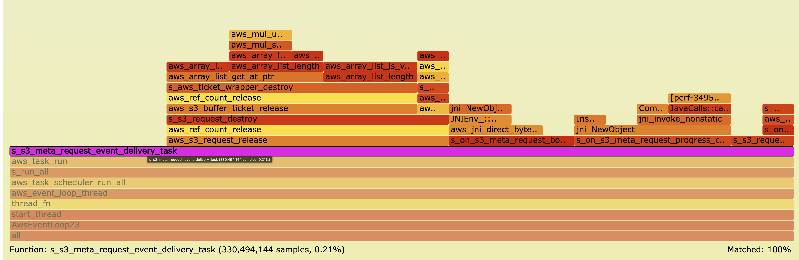
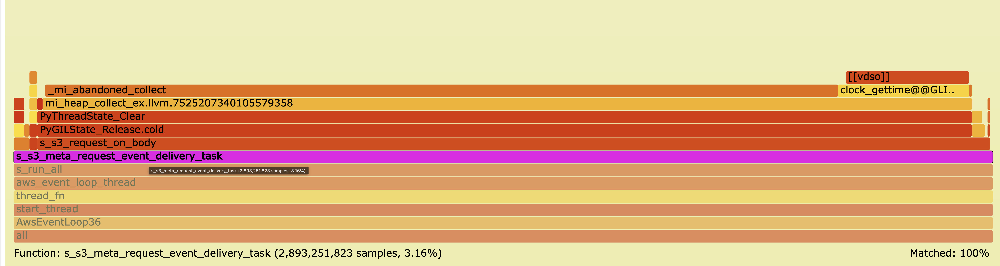

# CRT Binding Performance: S3 Download to RAM

## Summary

**The major bottleneck for high-throughput S3 downloads to RAM in the Java and Python CRT bindings is the cost of creating a language-managed buffer and copying data from C memory into it.**

Every time the CRT downloads a chunk of data from S3, it hands that chunk to the application via a callback ( `on_body` ). In the current Java and Python implementations, the binding converts the C-owned buffer into a language-native object before calling back:

- **Java**: allocates a `byte[]` on the JVM heap and copies the C buffer into it
- **Python**: calls `PyBytes_FromStringAndSize`, which allocates a `bytes` object and copies the C buffer into it

For a 30 GiB download broken into thousands of chunks, this copy happens millions of times, and the cumulative cost is severe: **Java runs at 22% of C throughput; Python at 48%**.

When the copy is removed — by switching Java to `DirectByteBuffer` (wraps C memory directly) and Python to `memoryview` (same idea) — both bindings jump back to **~90% of native C throughput**, confirming that the copy is the bottleneck, not the FFI call overhead itself.

> **Scope note:** These results are specific to the `on_body` data delivery path under high-throughput RAM download conditions. Other workloads (disk download, upload, other service calls) are not significantly affected. The control experiment confirms this: all three languages run within 8% of each other when downloading to disk.

## Experiments

Four experiments were run on the same EC2 host ( `us-west-2` ), profiled with `perf` at 99 Hz.

| # | Description | Workload | Purpose |
|---|-------------|----------|---------|
| 1 | **C baseline** | 30 GiB → RAM | Measure native performance with no FFI |
| 2 | **Java `byte[]` ** (current binding) | 30 GiB → RAM | Measure copy-based FFI overhead |
| 3 | **Python `bytes` ** (current binding) | 30 GiB → RAM | Measure copy-based FFI overhead |
| 4 | **Java `DirectByteBuffer` ** | 30 GiB → RAM | Measure overhead with copy removed |
| 5 | **Python `memoryview` ** | 30 GiB → RAM | Measure overhead with copy removed |
| 6 | **C / Java / Python → disk** | 5 GiB → disk | Control: confirm overhead is in `on_body` path |

The measurement focus is `s_s3_meta_request_event_delivery_task` — the function responsible for delivering each data buffer from the CRT to the application. Its share of total CPU time is the primary indicator of binding overhead.

## Detailed Results

### Experiment 1: C Baseline

```bash
sudo perf record -F 99 --call-graph dwarf -g \
  s3-benchrunner-c crt-c download-30GiB-1x-ram.run.json \
  aws-c-s3-test-bucket-269381--usw2-az1--x-s3 us-west-2 200.0
```

- **Throughput**: 69.4 Gb/s · **Duration**: 3.7 s · **Peak RSS**: 12,214 MiB
- `s_s3_meta_request_event_delivery_task`: **0.04%** of total samples

The event delivery task is a thin sliver. Most of the 0.04% is `aws_s3_request_release` (cleanup work), not any kind of data marshalling. This is the performance ceiling.

 · [Interactive flamegraph index](index.html)

---

### Experiment 2: Java — `byte[]` (current binding)

```bash
sudo perf record -F 99 --call-graph dwarf -g \
  java -jar s3-benchrunner-java.jar crt-java download-30GiB-1x-ram.run.json \
  aws-c-s3-test-bucket-269381--usw2-az1--x-s3 us-west-2 200.0
```

- **Throughput**: 15.7 Gb/s · **Duration**: 16.4 s (4.4× slower than C)
- `s_s3_meta_request_event_delivery_task`: **12.32%** of total samples (308× higher than C)
- Of that 12.32%, only 0.39% is cleanup — the remaining **99.6% is pure `byte[]` allocation and copy**

The flamegraph shows a wide `s_s3_meta_request_event_delivery_task` bar dominated by JNI array creation and memcpy.

 · [Interactive flamegraph index](index.html)

#### Scaling note

The overhead worsens as memory buffers grow. With a 1 TiB workload at 200 Gbps (32 GiB memory limit), the `on_body` variant drops to **13.2 Gbps** vs **127.8 Gbps** for the C-only path — a 90% slowdown. The copy cost scales with both buffer size and throughput.

---

### Experiment 3: Python — `bytes` (current binding)

```bash
sudo perf record -F 99 -g \
  python main.py crt-python download-30GiB-1x-ram.run.json \
  aws-c-s3-test-bucket-269381--usw2-az1--x-s3 us-west-2 200.0
```

- **Throughput**: 33.5 Gb/s · **Duration**: 7.7 s (2.1× slower than C)
- `s_s3_meta_request_event_delivery_task`: **6.77%** of total samples (169× higher than C)
- Of that 6.77%, only 0.57% is cleanup — the remaining **99.4% is `PyBytes_FromStringAndSize`**

The flamegraph shows the event delivery bar dominated by CPython object allocation and the data copy into a new `bytes` object.

 · [Interactive flamegraph index](index.html)

---

### Experiment 4: Java — `DirectByteBuffer` (zero-copy variant)

The binding was modified to wrap the C-owned buffer with `NewDirectByteBuffer` instead of copying into a `byte[]` . The `DirectByteBuffer` points directly into C memory — no copy.

```bash
perf record -F 99 -g java -jar s3-benchrunner-java.jar crt-java \
  download-30GiB-1x-ram.run.json \
  aws-c-s3-test-bucket-269381--usw2-az1--x-s3 us-west-2 200.0
```

- **Throughput**: 65.0 Gb/s · **Duration**: 3.96 s (**4.1× faster than Experiment 2**)
- `s_s3_meta_request_event_delivery_task`: **0.21%** of total samples (↓ from 12.32%)

The event delivery bar shrinks to nearly C-level. The remaining ~6% throughput gap vs C is JNI framing and JVM object-header overhead, not data copying.

 · [Interactive flamegraph index](index.html)

---

### Experiment 5: Python — `memoryview` (zero-copy variant)

The binding was modified to expose a `memoryview` into the C-owned buffer instead of calling `PyBytes_FromStringAndSize` . The `memoryview` points directly into C memory — no copy.

```bash
perf record -F 99 -g python main.py crt-python \
  download-30GiB-1x-ram.run.json \
  aws-c-s3-test-bucket-269381--usw2-az1--x-s3 us-west-2 200.0
```

- **Throughput**: 60.6 Gb/s · **Duration**: 4.25 s (**1.8× faster than Experiment 3**)
- `s_s3_meta_request_event_delivery_task`: **3.16%** of total samples (↓ from 6.77%)

The event delivery bar shrinks significantly. The remaining overhead (~13% gap vs C) is GIL acquisition and CPython interpreter bookkeeping — not data copying.

**Caveat**: `memoryview` is zero-copy only while the caller holds the view and does not materialise the data into Python objects. Any downstream operation that requires a `bytes` object (e.g., writing to a pipe, passing to most Python libraries) reintroduces the copy. See [aws-cli#8288](https://github.com/aws/aws-cli/issues/8288#issuecomment-1816886132) for a concrete example.

 · [Interactive flamegraph index](index.html)

---

### Experiment 6: Control — Download to Disk (5 GiB)

All three bindings were tested downloading to disk. When writing to disk the CRT writes directly without invoking the `on_body` callback, so no FFI data marshalling occurs.

```
C:      14.08 Gb/s  (3.05 s)  — baseline
Java:   14.10 Gb/s  (3.05 s)  — 100.1% of C
Python: 13.05 Gb/s  (3.29 s)  — 92.7% of C
```

All three languages converge to within 8% of each other. The binding overhead seen in Experiments 2 and 3 is entirely absent. [Interactive flamegraph index](index.html)

## Results Summary

| Experiment | Binding | Throughput | `event_delivery` % | vs C |
|------------|---------|------------|-------------------|------|
| 1 | C (baseline) | 69.4 Gb/s | 0.04% | 100% |
| 2 | Java `byte[]` | 15.7 Gb/s | 12.32% | 22.6% |
| 3 | Python `bytes` | 33.5 Gb/s | 6.77% | 48.3% |
| 4 | Java `DirectByteBuffer` ✨ | 65.0 Gb/s | 0.21% | 93.7% |
| 5 | Python `memoryview` ✨ | 60.6 Gb/s | 3.16% | 87.3% |
| 6 (control) | C / Java / Python → disk | ~14 Gb/s each | n/a | ~100% |

## Conclusion

The evidence across all six experiments points to a single root cause:

> **The dominant bottleneck for high-throughput S3 RAM downloads in the Java and Python CRT bindings is the allocation and copy of a language-managed buffer ( `byte[]` / `bytes` ) for each downloaded chunk.**

Specifically:

1. **Experiments 2 & 3** show severe throughput loss (Java −77%, Python −52%) correlated with the event delivery task consuming 12.32% and 6.77% of CPU respectively — nearly all of it allocating and filling language buffers.

2. **Experiments 4 & 5** isolate the cause: removing the copy (via `DirectByteBuffer` / `memoryview`) eliminates almost all of the overhead. Java recovers to 93.7% of C; Python to 87.3%. The residual gap is JNI/CPython overhead unrelated to data copying.

3. **Experiment 6 (control)** eliminates alternative explanations: when the `on_body` callback is not invoked (disk download), all three languages perform within 8% of each other, proving the bottleneck is in the callback path, not in connection setup, TLS, checksums, or binding infrastructure.

**Implication for optimization**: The most direct fix is to change the binding to deliver data via a zero-copy view ( `DirectByteBuffer` / `memoryview` ) rather than allocating and copying. The zero-copy APIs work well for use cases where the caller can process the data in-place within the callback. For use cases that require materialising the data into language objects (e.g., passing to most Python libraries, writing to a pipe), the copy is unavoidable with today's language runtimes; buffer pooling to amortise allocation cost would be the next avenue.

---

## ⚠️ Caveat: Zero-Copy APIs Transfer Ownership Responsibility to the Caller

`DirectByteBuffer` (Java) and `memoryview` (Python) eliminate the copy by handing the application a **view into C-owned memory**. This is powerful but comes with important constraints:

### The language does not own the data

The buffer backing the view is owned and managed by the CRT's C runtime, not by the JVM or CPython garbage collector. The CRT may release or reuse that memory as soon as the callback returns.

**Java `DirectByteBuffer` **
- The `DirectByteBuffer` object itself is a JVM object and will be garbage collected normally.
- But the **memory it points to** is C memory. Reading the buffer after the callback returns is undefined behavior — the C layer may have freed it.
- Any operation that needs to retain the data after the callback (storing it in a field, passing it to an async operation, adding it to a list) must copy it first.

**Python `memoryview` **
- The `memoryview` is a live view into the C buffer for the duration of the callback.
- As soon as the callback returns, the CRT may reclaim the underlying C memory.
- Calling `bytes(mv)` or `bytearray(mv)` within the callback creates a copy — this is safe but reintroduces the copy cost.
- Simply storing the `memoryview` object beyond the callback lifetime without copying is **unsafe**.

### Most real-world usages require a copy anyway

In practice, the zero-copy path benefits only the narrow case where the caller can **fully consume the data in-place before the callback returns** — for example, computing a checksum, writing directly to a pre-allocated output buffer, or passing to a C extension that processes synchronously.

The moment the caller needs to do any of the following, a copy is unavoidable:

| Use case | Copy required? |
|----------|---------------|
| Process data synchronously in the callback (checksum, sum, etc.) | ❌ No copy needed |
| Write to a pre-allocated output buffer owned by the caller | ❌ No copy needed |
| Pass to an async operation or store for later | ✅ Must copy |
| Pass to a Python library that expects `bytes` | ✅ Must copy |
| Write to stdout / a pipe | ✅ Must copy |
| Add to a `list` or `dict` | ✅ Must copy |

See [aws-cli#8288](https://github.com/aws/aws-cli/issues/8288#issuecomment-1816886132) for a real-world example: piping S3 data to a downstream process requires writing to stdout, which necessitates a copy regardless of whether `memoryview` is used.

### Summary

> **Zero-copy variants shift the problem rather than eliminate it.** They are a meaningful optimization for specific in-place processing workloads, but for general-purpose data delivery (the common case), the copy to a language-owned buffer is still required — either inside the binding or inside the callback. Buffer pooling (reusing pre-allocated language buffers) is likely the more broadly applicable optimization.

## Related Resources

- [awslabs/aws-crt-java](https://github.com/awslabs/aws-crt-java)
- [awslabs/aws-crt-python](https://github.com/awslabs/aws-crt-python)
- Java FFM API: https://docs.oracle.com/en/java/javase/21/core/foreign-function-and-memory-api.html
